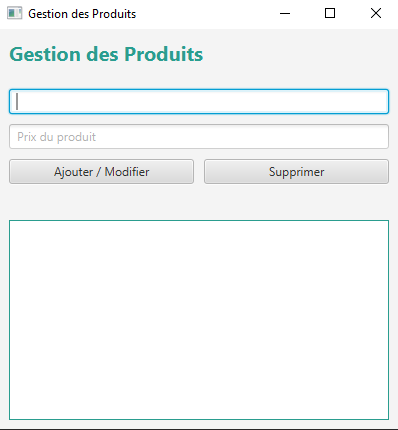
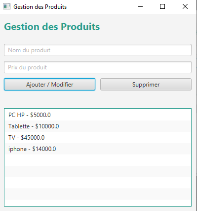
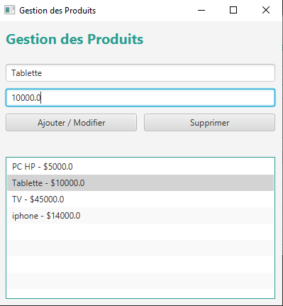

# 🛍️ JavaFX Product Manager

Une application JavaFX simple pour gérer une liste de produits. L'interface permet d'ajouter, modifier et supprimer des produits avec un affichage dynamique dans une `ListView`.

---

## 📸 Aperçu de l'application


### 🧾 Formulaire et liste des produits



### ✏️ Mise à jour d'un produit



---

## ✅ Fonctionnalités

- 🔍 **Afficher la liste des produits**
- ➕ **Ajouter** un produit (nom + prix)
- ✏️ **Modifier** un produit sélectionné
- ❌ **Supprimer** un produit
- ⚠️ Affichage de messages d'erreur si les champs sont vides ou invalides
- 🎨 Interface stylisée avec CSS

---

## 📦 Structure du projet
```` bash 
src/
├── ma/enset/tp_javafx/
│ ├── Product.java # Classe modèle
│ ├── ProductController.java # Contrôleur logique (JavaFX)
│ ├── MainApplication.java # Point d’entrée JavaFX
│ ├── product-view.fxml # Interface graphique FXML
│ └── style.css # Feuille de style JavaFX
````
